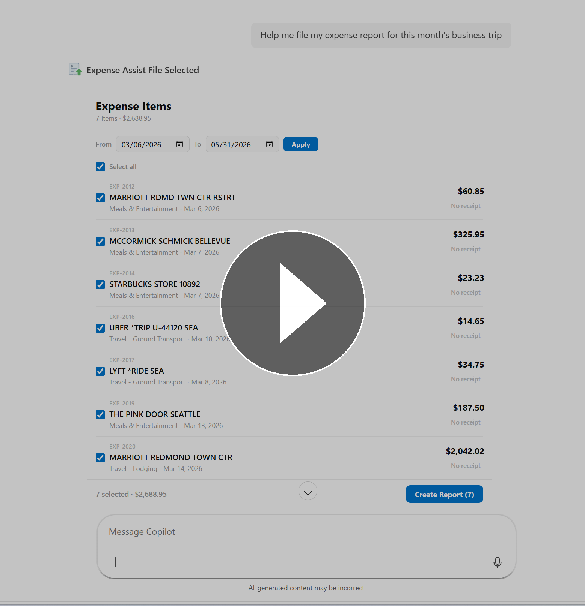
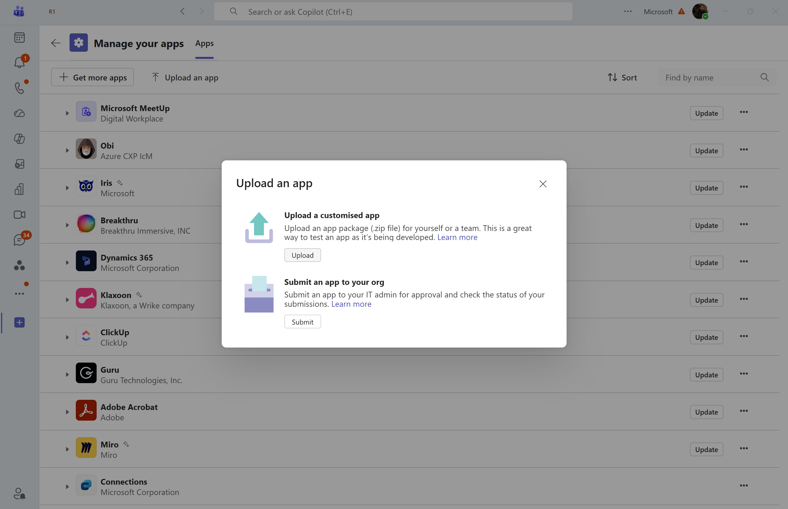

# Expense Submission Agent (MCP App)

## 1. What this sample is about

This sample demonstrates document and file-related workflows in Copilot — scenarios where users need to find, process and act on files scattered across Email, SharePoint, and local folders. For example, employees in an organization can quickly file their business expenses by having Copilot surface relevant receipts from organizational sources, automatically map them to expense line items to eliminate manual data entry, and provide an interactive UX that keeps users in control with deterministic updates to the system of record.

This sample also demonstrates **Entra SSO** with **On-Behalf-Of (OBO) flow** to securely access **Microsoft Graph APIs** on behalf of the signed-in user, so that files from Email, SharePoint, and OneDrive can be downloaded and stored in your system of record.

The MCP server is implemented with the official TypeScript SDK and [MCP Apps](https://github.com/modelcontextprotocol/ext-apps) (`@modelcontextprotocol/ext-apps`), exposing UI-bearing tools so you can experiment with Copilot tool invocation and widget rendering end-to-end.

The sample includes:

- `list_expense_items` — interactive expense list with date filtering
- `create_expense_report_draft` — draft report creation from selected expense items
- `add_expense_receipts` — Automatically match attached receipts from local folder, OneDrive/SharePoint or email
- `fetch_draft_expense_report` — retrieve current draft details
- `submit_expense_report` — submit finalized report for approval

## 2. Demo video

[](https://www.youtube.com/watch?v=Jh7w13q-a6I&t=3s)

- Watch demo on YouTube: https://www.youtube.com/watch?v=Jh7w13q-a6I&t=3s

---

## 3. Sample prompts

| Prompt | What it does |
|--------|-------------|
| *Help me file my expense report for my business trip in February and March* | Lists expense items, lets you select them, creates a draft, auto-matches email receipts, and guides you through submission |
| *(Upload receipts from `sample-receipts/` in Copilot chat)* | The agent automatically matches uploaded receipts with your system of record data (in this example, dummy corporate card transactions). |

> **Seed data & sample receipts:** The seed data in [`db/expenses.json`](db/expenses.json) contains 15 dummy corporate card transactions dated **February 5 – March 14, 2026**. The [`sample-receipts/`](sample-receipts/) folder contains matching PDF receipts you can upload in Copilot chat to test the receipt-matching flow. Use prompts that reference this date range (e.g. "February and March") so the agent finds the seeded expenses.


---

## 4. Pre-requisites

### Required (to run locally)

- [Node.js](https://nodejs.org/) 18+ (v22 recommended)
- npm 9+

### Required (to test in Copilot)

- [Microsoft 365 Agents Toolkit](https://aka.ms/teams-toolkit) VS Code extension (v6.6.1 or above)
- [Microsoft 365 Copilot license](https://learn.microsoft.com/microsoft-365-copilot/extensibility/prerequisites#prerequisites)
- A [Microsoft 365 developer account](https://docs.microsoft.com/microsoftteams/platform/toolkit/accounts)

---

## 5. Authentication & file handling

This sample uses **Microsoft Entra ID** for authentication. You need an app registration to authenticate users and perform OBO token exchanges for Microsoft Graph API access.

### Step 1: Create an Entra ID app registration

1. Go to the [Azure portal → App registrations](https://portal.azure.com/#view/Microsoft_AAD_RegisteredApps/ApplicationsListBlade) and select **New registration**.
2. Name the app (e.g. `Expense Submission MCP`) and set **Supported account types** to your preference (single-tenant or multi-tenant).
3. Under **Redirect URIs**, add a **Web** platform redirect URI:
   - `https://teams.microsoft.com/api/platform/v1.0/oAuthConsentRedirect`
4. Click **Register**.

### Step 2: Configure API permissions

Add the following **delegated** Microsoft Graph permissions:

| Permission | Type | Purpose | Admin consent? |
|------------|------|---------|----------------|
| `Files.SelectedOperations.Selected` | Delegated | Read only files the user explicitly attached in the current interaction | **No** — user-consentable |
| `Mail.Read` | Delegated | Read email attachments to auto-match receipts | Depends on tenant policy |
| `User.Read` | Delegated | Sign-in and read user profile (Entra SSO) | No |

<!-- Alternative: Use Files.Read.All instead of Files.SelectedOperations.Selected
| `Files.Read.All` | Delegated | Read any file the user can access across OneDrive/SharePoint | **Yes** — requires tenant admin consent |
-->

> **Choosing a file access scope** — see [section 5.2](#52-handling-the-file-url-on-your-server) below for a detailed comparison of the two options.

### Step 3: Create a client secret

1. Go to **Certificates & secrets** → **New client secret**.
2. Copy the secret value — you will need it for the `ENTRA_CLIENT_SECRET` environment variable.

### Step 4: Expose an API (for Entra SSO)

1. Go to **Expose an API** and set the **Application ID URI** (e.g. `api://<client-id>`).
2. Add a scope named `access_as_user` with admin and user consent.
3. Under **Authorized client applications**, add the following client ID:
   - `ab3be6b7-f5df-413d-ac2d-abf1e3fd9c0b` (Microsoft enterprise token store)

### Step 5: Register SSO client in Teams Developer Portal

1. Open the [Teams Developer Portal](https://dev.teams.microsoft.com/tools). Select **Tools → Microsoft Entra SSO client ID registration**.
2. Fill in the following fields:
   - **Registration name** — A friendly name (e.g. `Expense Submission SSO`).
   - **Base URL** — Your MCP server's base URL (e.g. `https://<your-tunnel>.devtunnels.ms`). This must match the `url` in your plugin manifest's [MCP server spec object](https://learn.microsoft.com/microsoft-365/copilot/extensibility/plugin-manifest-2.4#mcp-server-spec-object).
   - **Restrict usage by org** — Select which Microsoft 365 organization has access.
   - **Restrict usage by app** — Select **Any Teams app** if you don't know your final app ID. After publishing, bind this registration with your published app ID.
   - **Client ID** — The client ID from your Entra app registration (Step 1).
4. Select **Save**.
5. Completing the registration generates a **Microsoft Entra SSO registration ID** and an **Application ID URI**.

### Step 6: Update the Entra app registration with the generated Application ID URI

1. Open [Microsoft Entra admin center](https://entra.microsoft.com/). Navigate to the app registration from Step 1.
2. Go to **Expose an API**. Add the **Application ID URI** generated by the Teams Developer Portal in Step 5. If you already have an existing Application ID URI (e.g. `api://<client-id>`), use the **manifest editor** to add the new URI alongside it:

   ```json
   "identifierUris": [
     "api://<client-id>",
     "<URI-from-Teams-Developer-Portal>"
   ]
   ```

   > **Note:** Adding multiple URIs isn't supported through the Entra admin center's UI — use the manifest editor. The UI only displays the first URI, but adding multiple URIs doesn't affect your existing URIs and scopes.

### Step 7: Add the SSO registration ID to the plugin manifest

In [`appPackage/ai-plugin.json`](appPackage/ai-plugin.json), set the `auth` property in your runtime to use the SSO registration ID from Step 5:

```json
"auth": {
  "type": "OAuthPluginVault",
  "reference_id": "<your-SSO-registration-ID>"
}
```

### Step 8: Update `webApplicationInfo` in the Teams app manifest

In [`appPackage/manifest.json`](appPackage/manifest.json), update the `webApplicationInfo` section with your Entra app registration's client ID and Application ID URI:

```json
"webApplicationInfo": {
    "id": "<your-entra-client-id>",
    "resource": "api://<your-entra-client-id>"
}
```

This is **required** for the Microsoft 365 admin to see and grant API permissions for your app in the [M365 Admin Center](https://admin.microsoft.com/). Without this, the admin consent experience will not surface your app's permission requests.

### Step 9: Update your `.env` file

Set the values from your app registration in `.env`:

```env
ENTRA_CLIENT_ID=<your-app-client-id>
ENTRA_CLIENT_SECRET=<your-client-secret>
```

> **`ENTRA_CLIENT_SECRET`** is required for the OBO token exchange. Without it, receipt download from Graph will fail.

### Step 10: Accept the new token audience in your server

Update your MCP server to allow the new Application ID URI (from Step 5) as the token audience. If your server validates the client application ID, ensure the Microsoft enterprise token store's client ID (`ab3be6b7-f5df-413d-ac2d-abf1e3fd9c0b`) is added as an allowed client application.

> **Tip:** If your MCP server uses the [on-behalf-of flow](https://learn.microsoft.com/entra/identity-platform/v2-oauth2-on-behalf-of-flow) to access another API that requires user consent, return a `401 Unauthorized` error to cause the agent to prompt the user to sign in and grant consent.

For the full authentication reference, see [Configure authentication for MCP and API plugins in agents](https://learn.microsoft.com/microsoft-365/copilot/extensibility/plugin-authentication#microsoft-entra-id-sso-authentication).

### 5.1 How to accept file URLs in your DA tool

To receive a `file_url` when a user attaches a file, define your tool with a `file_url` parameter.

#### Best practices for tool schema design

| Practice | Rationale |
|----------|-----------|
| Name the parameter `file_url` | Consistent naming helps the LLM correctly map the URL to the file attachment |
| Make `file_url` required if your tool always needs a file | Prevents the LLM from calling the tool without a URL |
| Accept multiple file URLs as an array if needed | For tools that process batches: `file_urls: string[]` |
| Include `file_name` as an optional parameter | Copilot can provide the original filename alongside the URL |

#### `microsoft/filePermissionGrant` (required only for `Files.SelectedOperations.Selected`)

If you are using `Files.SelectedOperations.Selected` (the recommended least-privilege scope), you must include the `_meta.microsoft/filePermissionGrant` property in your tool definition so Copilot can grant your app file-level access before invoking the tool. **This is not required if you are using `Files.Read.All`.**

**MCP tool definition** (`mcp_tool_description` in manifest):

```json
{
    "name": "process_document",
    "inputSchema": {
        "type": "object",
        "properties": {
            "file_url": {
                "type": "string",
                "description": "URL of the file to process"
            }
        }
    },
    "_meta": {
        "microsoft/filePermissionGrant": {
            "clientId": "{mcp-agent-entra-client-id}",
            "parameters": [
                { "jsonPath": "$.file_url" }
            ]
        }
    }
}
```

The `_meta.microsoft/filePermissionGrant` property tells Copilot:
- **`clientId`** — the Entra ID app registration client ID of your MCP agent. Copilot uses this to grant the app file-level access before invoking the tool.
- **`parameters`** — an array of JSON path expressions pointing to the tool input parameters that contain file URLs. Copilot will grant access to each referenced file before the tool call.

> Without this metadata, Copilot cannot grant your app permission to access the attached files, and the Graph API call will fail with a `403`.

> **Note:** The `filePermissionGrant` flow only grants access to files that the user explicitly uploaded or selected in the M365 Copilot chat. Files referenced  from other sources (e.g. search results, prior conversation context) are not covered by this grant.

### 5.2 Handling the file URL on your server

When your tool server receives a call with `file_Url`, use **Microsoft Entra ID** authentication with the **On-Behalf-Of (OBO) flow** to download the file via Microsoft Graph API.

#### Authentication flow

```
1. User invokes DA tool → your server receives user token (via Entra OAuth/SSO)
      │
      ▼
2. Your server exchanges user token for OBO Graph token
      │  POST https://login.microsoftonline.com/{tenant}/oauth2/v2.0/token
      │  grant_type=urn:ietf:params:oauth:grant-type:jwt-bearer
      │  scope=<chosen scope — see comparison below>
      │  assertion={user_token}
      │
      ▼
3. Call Graph API to download the file using fileUrl
      │  GET https://graph.microsoft.com/v1.0/shares/{encoded_share_url}/driveItem/content
      │  Authorization: Bearer {obo_graph_token}
      │
      ▼
4. Receive file content → process → return result to Copilot
```

#### Choosing a Graph API scope

The OBO exchange requires a Graph API scope. There are two options:

|  | **Option 1: `Files.Read.All`** | **Option 2: `Files.SelectedOperations.Selected`** (preferred) |
|---|---|---|
| **Scope** | `https://graph.microsoft.com/Files.Read.All` | `https://graph.microsoft.com/Files.SelectedOperations.Selected` |
| **Access breadth** | All files the user has access to across OneDrive and SharePoint | Only files the user explicitly selected (attached) in the current interaction |
| **Admin consent** | Typically requires tenant admin consent | User-consentable — no admin consent required in most tenants |
| **Least privilege** | Broad — grants read access to the user's entire file graph | Narrow — scoped to the specific files the user chose to share |
| **Recommendation** | Use when your tool needs broader file access | **Preferred** — use when your tool only processes user-attached files |

> **Important — Option 2 requires a Copilot-side permission grant:** `Files.SelectedOperations.Selected` only allows access to files that have been explicitly granted to the agent's app. Unlike `Files.Read.All`, this scope does not provide blanket read access — each file must be individually authorized. Copilot calls the Graph API to grant the DA's Entra ID app permission to access the attached file(s) before the Copilot tool call is executed. This grant is scoped to the specific files the user attached and is performed on behalf of the user.

#### Step-by-step

1. **Register a Microsoft Entra ID app** — configure your DA with an Entra ID app registration that supports OAuth/SSO (see Steps 1–4 above).
2. **Configure Graph API permissions** — add the delegated permission for your chosen option:
   - Option 1: `Files.Read.All` — reads any file the user can access
   - Option 2: `Files.SelectedOperations.Selected` — reads only files the user explicitly selected
3. **Receive user token** — when the user calls your tool, your server receives a user token via the OAuth/SSO flow configured in your DA manifest.
4. **Exchange for OBO Graph token** — use the OBO flow to exchange the user token for a Graph API token with your chosen scope. This token inherits the user's permissions.
5. **Download the file via Graph API** — use the `fileUrl` received in the tool arguments to construct a Graph API sharing URL request. The Graph [Shares API](https://learn.microsoft.com/graph/api/shares-get) accepts an encoded sharing token in place of an item ID. To build it, apply the following transformation to the raw file URL:

   1. Base64-encode the file URL.
   2. Convert to base64url: replace `/` with `_`, `+` with `-`, and trim any trailing `=` padding.
   3. Prepend the `u!` prefix.

   **Example (TypeScript):**
   ```ts
   function encodeFileUrl(fileUrl: string): string {
     const base64 = Buffer.from(fileUrl).toString('base64')
       .replace(/=/g, '')
       .replace(/\+/g, '-')
       .replace(/\//g, '_');
     return `u!${base64}`;
   }
   ```

   Then use a **two-step** process to retrieve the file:

   **Step A — Get driveItem metadata** (includes a pre-authenticated download URL):
   ```
   GET https://graph.microsoft.com/v1.0/shares/u!{encoded}/driveItem
   Authorization: Bearer {obo_graph_token}
   ```
   The response JSON contains the file's `name`, `size`, `file.mimeType`, `webUrl`, and the `@microsoft.graph.downloadUrl` OData annotation — a pre-authenticated SAS URL.

   > **Note:** `@microsoft.graph.downloadUrl` is returned by default on the driveItem response but is **not** available via `$select`. Do not add a `$select` query parameter or you may lose this field.

   **Step B — Download the file content** using the SAS URL from the previous response:
   ```
   GET {item['@microsoft.graph.downloadUrl']}
   ```
   This URL is pre-authenticated — no `Authorization` header is needed.

6. **Process the file content** — once downloaded, the file content is in its original format (`.pdf`, `.docx`, etc.) and can be processed by your tool.
7. **Return the result** — send the tool response back to Copilot.

> **Note on protected files (MIP):** If your organization uses Microsoft Information Protection (MIP) to label and encrypt files, you would additionally need to obtain OBO tokens with Azure RMS and MIP Sync Service scopes, then use the [Microsoft Information Protection SDK](https://learn.microsoft.com/information-protection/develop/) to decrypt the file content before processing. This sample does not implement MIP decryption.

---

## 6. Development (run locally + dev tunnel)

### Step 1: Clone this repo and navigate to the project folder

```powershell
git clone https://github.com/microsoft/mcp-interactiveUI-samples.git
cd mcp-interactiveUI-samples/mcp-apps/expense-submission/node
```

### Step 2: Install Node.js and npm (skip if already installed)

Check if Node.js and npm are already installed:

```bash
node -v
npm -v
```

If both commands return version numbers (Node.js 18+ and npm 9+), skip to Step 3. Otherwise, install them:

#### Windows (PowerShell)

```powershell
winget install OpenJS.NodeJS.LTS
```

#### macOS (Terminal)

```bash
brew install node
```

### Step 3: Configure environment variables

Open the [`.env`](.env) file in the project root. The only values you need to update are:

```env
ENTRA_CLIENT_ID=<your-entra-client-id>          # From Step 1
ENTRA_CLIENT_SECRET=<your-client-secret>         # From Step 3
```

Everything else (`AZURE_STORAGE_CONNECTION_STRING`, `PORT`, `ENTRA_TENANT_ID`) is pre-configured for local development with Azurite and can be left as-is.

### Step 4: Run locally

The server uses Azure Table Storage. For local development, [Azurite](https://learn.microsoft.com/azure/storage/common/storage-use-azurite) is used as a local emulator. The seed script creates and populates the following tables:

| Table | Description |
|-------|-------------|
| `Expenses` | Expense line items (credit card transactions) |
| `Drafts` | Draft and submitted expense reports |

Run these commands in order:

```bash
npm install

# Start Azurite table emulator (run in a separate terminal)
npm run start:azurite

# Seed the database with sample expense items
npm run seed

# Build the UI widgets
npm run build:widgets

# Start the MCP server
npm run dev
```

> `npm run seed` populates the local tables with 15 sample expense items from `db/expenses.json` dated **February 5 – March 14, 2026**. Matching PDF receipts are in the `sample-receipts/` folder. You only need to run this once (or again to reset data).

Server endpoint:

- `http://localhost:3001/mcp`

### Expose via dev tunnel

Use [Dev Tunnels](https://learn.microsoft.com/azure/developer/dev-tunnels/) to expose your local MCP server publicly:

```bash
devtunnel host -p 3001 --allow-anonymous
```

Copy the forwarded URL (e.g. `https://<tunnel-id>.devtunnels.ms`) and use it in section 7 below.

---

## 7. How to test in Copilot

### Quick test

1. Open [`appPackage/ai-plugin.json`](appPackage/ai-plugin.json).
2. Replace the spec URL with your local tunnel MCP URL from section 6.

	 ```json
	 "runtimes": [
		 {
			 "type": "RemoteMCPServer",
			 "spec": {
				 "url": "<your-mcp-server-url>",
				 "mcp_tool_description": {
					 "...": "..."
				 }
			 }
		 }
	 ]
	 ```
3. In the same file, update the `auth` `reference_id` with your Entra SSO registration ID from [Step 5](#step-5-register-sso-client-in-teams-developer-portal):

	 ```json
	 "auth": {
		 "type": "OAuthPluginVault",
		 "reference_id": "<your-SSO-registration-ID>"
	 }
	 ```
4. Open [`appPackage/mcp-tools.json`](appPackage/mcp-tools.json) and update the `clientId` in the `_meta.microsoft/filePermissionGrant` property with your Entra app's client ID (required for file permission grants when using `Files.SelectedOperations.Selected`):

	 ```json
	 "_meta": {
		 "microsoft/filePermissionGrant": {
			 "clientId": "<your-entra-client-id>",
			 "parameters": [
				 { "jsonPath": "$.receipts[*].file_url" }
			 ]
		 }
	 }
	 ```
5. Open [`appPackage/manifest.json`](appPackage/manifest.json) and update `webApplicationInfo` with your Entra app's client ID and Application ID URI:

	 ```json
	 "webApplicationInfo": {
		 "id": "<your-entra-client-id>",
		 "resource": "api://<your-entra-client-id>"
	 }
	 ```
6. Zip the [appPackage](appPackage) folder.
7. Sideload the package into Teams.



If you are customizing tool definitions (adding/updating tools), you can use M365 Agents Toolkit to create a declarative agent from your MCP server URL. See [M365 Agents Toolkit Instructions](../../../M365-Agents-Toolkit-Instructions.md) for details.

## 8. Next steps

- Customize data sources for your environment
- Create your own components
